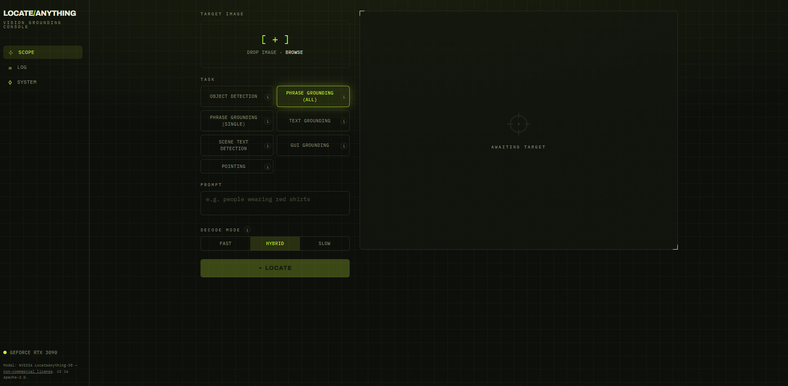
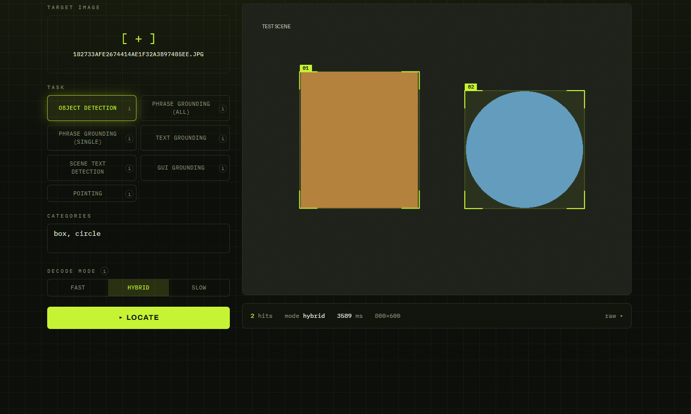
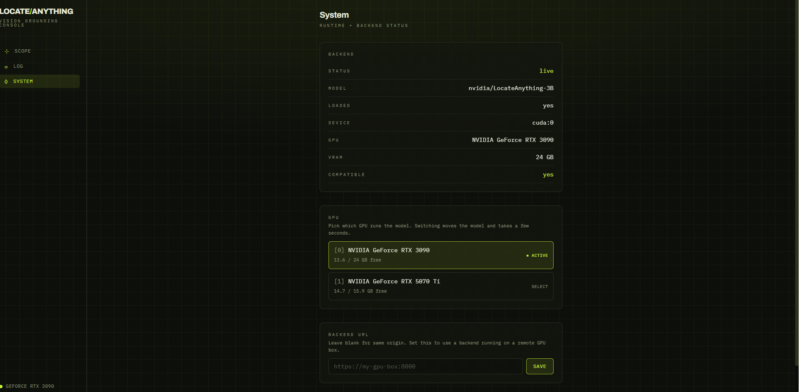

# locate-anything

A sleek, mobile-friendly web UI for **[NVIDIA LocateAnything-3B](https://huggingface.co/nvidia/LocateAnything-3B)** — point it at an image, type what you want to find in plain language, and get bounding boxes back. Object detection, phrase grounding, OCR/text localization, document layout, GUI element grounding, and pointing — all from one prompt box.

Run it on your own NVIDIA GPU with a single `docker compose up`.

> [!IMPORTANT]
> **Model license is non-commercial.** `LocateAnything-3B` is released under the [NVIDIA license](https://huggingface.co/nvidia/LocateAnything-3B) for **academic / research / non-commercial** use only. This UI is a convenience wrapper — using it does not grant any commercial rights to the model. The UI code itself is Apache-2.0 (see [LICENSE](./LICENSE)).

## Features

- **One prompt, many tasks** — detection, phrase grounding, text detection, document layout, GUI grounding, pointing.
- **Speed/quality toggle** — `fast` / `hybrid` / `slow` Parallel Box Decoding.
- **Search history** — every search (image + prompt + results) is saved and re-runnable.
- **Mobile-first** — works on your phone, including the camera.
- **GPU preflight** — tells you up front whether your card is supported.

## Screenshots

|  |  |
|---|---|
| **Home** — upload, prompt, task presets, decode mode | **Detection** — reticle boxes drawn over the image |
|  |  |

**System** — GPU/health readout, GPU picker, and the configurable backend URL



## Demo

Detecting chickens in a live scene — prompt to reticle boxes:

https://github.com/user-attachments/assets/105110b3-1ab8-4107-99f4-14dcdb5aad82

## Requirements

- An NVIDIA GPU: **Ampere / Lovelace / Hopper / Blackwell** — RTX **30 / 40 / 50**-series, A100, H100. ~**12GB+ VRAM** recommended. (The image ships CUDA 12.8 PyTorch with native kernels through Blackwell `sm_120`, so 50-series cards work out of the box; pre-Ampere cards aren't supported by the model.)
- **Docker** with the NVIDIA Container Toolkit (`--gpus all`). Works on native Linux, **WSL2**, and Windows via Docker Desktop's WSL2 backend.
- Linux / WSL2 host (the model is Linux + CUDA + BF16 only).

## Supported GPUs

Rule of thumb: **any NVIDIA GPU with CUDA compute capability ≥ 8.0 (Ampere or newer)**. The model uses BF16, which rules out pre-Ampere cards. ~12GB+ VRAM is recommended — 8GB cards can work but may run out of memory on large images.

| Architecture | Compute | Consumer (GeForce) | Workstation / Data center |
|---|---|---|---|
| **Blackwell** | 10.0 / 12.0 | RTX 5090, 5080, 5070 Ti, 5070, 5060 Ti, 5060 | RTX PRO 6000 Blackwell, B100, B200 |
| **Hopper** | 9.0 | — | H100, H200, GH200 |
| **Ada Lovelace** | 8.9 | RTX 4090, 4080 (Super), 4070 Ti/Super, 4070 (Super), 4060 Ti, 4060 | RTX 6000 Ada, L40/L40S, L4 |
| **Ampere** | 8.0 / 8.6 | RTX 3090 Ti, 3090, 3080 Ti, 3080, 3070 Ti, 3070, 3060 Ti, 3060 (12GB) | A100, A40, A30, A10, RTX A6000/A5000/A4000 |

Laptop/mobile and "Super"/"Ti" variants of the above are also fine. **Not supported:** GTX 10-series (Pascal), RTX 20-series / GTX 16-series (Turing) — no BF16. Run `bash scripts/check-gpu.sh` to confirm your card.

## Quickstart

### Option A — prebuilt images (no source, no build)

On Windows, first install **Docker Desktop** (choose the **WSL 2** engine and enable
WSL Integration). Optionally confirm Docker can see your GPU:

```bash
docker run --rm --gpus all nvidia/cuda:12.8.1-base-ubuntu22.04 nvidia-smi
```

Then, in an empty folder, grab the end-user compose file and start it.

**Linux / macOS / WSL:**

```bash
mkdir la-app && cd la-app
curl -O https://raw.githubusercontent.com/gammahazard/locate-anything/main/docker-compose.ghcr.yml
mv docker-compose.ghcr.yml docker-compose.yml
docker compose pull
docker compose up
```

**Windows (PowerShell):**

```powershell
mkdir la-app; cd la-app
curl.exe -O https://raw.githubusercontent.com/gammahazard/locate-anything/main/docker-compose.ghcr.yml
Move-Item -Force docker-compose.ghcr.yml docker-compose.yml
docker compose pull
docker compose up
```

Open <http://localhost:9080>. On the **first run** the backend downloads the ~6GB
model into a cached volume — the UI shows "loading model…" until it's ready (a minute
or two), then later runs start in seconds. Pin a version with `LA_VERSION=0.1.1` in a
`.env` (the image tag has no leading `v`); omit it for `latest`.

### Option B — build from source (developers)

```bash
git clone git@github.com:gammahazard/locate-anything.git
cd locate-anything
cp .env.example .env
docker compose up        # builds the images locally
```

Then open <http://localhost:9080>. The first run downloads the ~6GB model into a cached volume; later runs are fast.

Not sure your card is supported? Run the preflight check first:

```bash
bash scripts/check-gpu.sh
```

### Ports already in use?

Only the **web UI** port (9080) needs to be free — the backend isn't published by
default. If 9080 is taken, either set `FRONTEND_PORT` in `.env`, or let the helper
pick the next free port automatically:

```bash
scripts/run.sh           # finds a free UI port and prints the URL
scripts/run.sh --ghcr    # prebuilt images   ·   --mock for no-GPU
```

### No GPU? Try the UI in mock mode

No GPU, no model download — deterministic fake boxes so you can explore the whole UI on any machine:

```bash
docker compose -f docker-compose.yml -f docker-compose.mock.yml up
```

### Remote GPU (use the UI from anywhere)

No compatible local card — or on a Mac? Run the stack on any Linux GPU box and
expose the backend port, then open the UI anywhere and set the backend URL under
**System → backend url** — your phone or laptop drives a remote GPU over HTTP:

```bash
docker compose -f docker-compose.yml -f docker-compose.expose-backend.yml up
```

## Development

See [CONTRIBUTING.md](./CONTRIBUTING.md) for local dev (without Docker), commit conventions, and the test suite.

## Acknowledgements

Built on NVIDIA's [LocateAnything-3B](https://research.nvidia.com/labs/lpr/locate-anything/). This project is not affiliated with or endorsed by NVIDIA.
